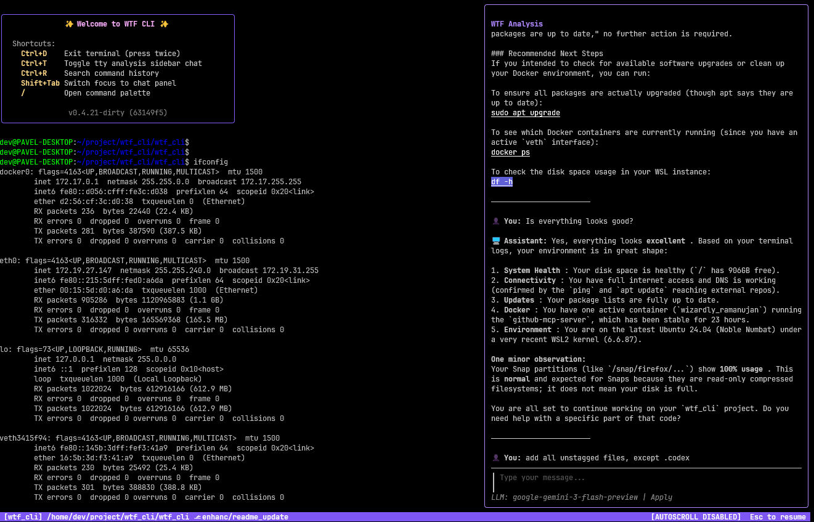

# WTF CLI - AI Assisted Terminal

A transparent PTY-based terminal wrapper with AI-powered assistance. Get instant explanations for errors, suggestions for fixes, and interactive chat with an AI that sees your terminal context.



## 🚀 Getting Started

### Prerequisites

- Go 1.24+
- Linux or macOS
- OpenRouter API key (for AI features)

### Installation

#### Option 1: Download Pre-built Binary (Recommended)

Download the latest release for your platform from the [Releases page](https://github.com/pakru/wtf_cli/releases):

```bash
# Linux/macOS example
wget https://github.com/pakru/wtf_cli/releases/latest/download/wtf_cli_<version>_<os>_<arch>.tar.gz
tar -xzf wtf_cli_<version>_<os>_<arch>.tar.gz
chmod +x wtf_cli
./wtf_cli --version

# Optionally install to PATH
sudo mv wtf_cli /usr/local/bin/
```

#### Option 2: Build from Source

```bash
# Clone the repository
git clone https://github.com/pakru/wtf_cli.git
cd wtf_cli

# Build
make build

# Run
./wtf_cli
```

### Usage

```bash
# Check version
./wtf_cli --version

# Start the wrapper
./wtf_cli

# Use your terminal normally
ls -la
cd ~/projects

# Press / at an empty prompt to open command palette
# Select a command with arrow keys and Enter

# Press Ctrl+R to search command history
# Type to filter, use Up/Down/Tab to select

# Press Ctrl+T to toggle the AI chat sidebar
# Type questions and get context-aware responses
```

## ✨ Features

### Implemented ✅

- **Transparent PTY Wrapper**: Seamless terminal proxy that feels native
- **Full Terminal Support**: Works with vim, htop, nano, and all terminal apps
- **Signal Handling**: Proper SIGWINCH (resize), SIGINT, SIGTERM support
- **Circular Buffer**: Captures last 2000 lines of terminal output
- **Modern TUI**: Built with Charm's Bubble Tea and Lipgloss
- **Status Bar**: Shows current directory and helpful hints
- **Command Palette**: Press `/` to access AI commands
- **History Search**: Press `Ctrl+R` to search command history
- **Welcome Banner**: Helpful shortcut reference on startup
- **AI Chat Sidebar**: Interactive chat with context-aware AI assistant
- **Streaming Responses**: Real-time AI response streaming
- **Password Protection**: Automatic detection of password prompts - sensitive input is never captured or sent to the LLM
- **Clipboard Paste**: Full paste support into the terminal
- **Cursor Navigation**: Left/Right arrow keys, Home/End support in command line

### Commands (Available)

| Command | Description |
|---------|-------------|
| `/chat` | Toggle AI chat sidebar |
| `/explain` | Analyze last output and suggest fixes |
| `/history` | Show command history |
| `/settings` | Open settings panel |
| `/help` | Show help |

### Keyboard Shortcuts

| Shortcut | Action |
|----------|--------|
| `Ctrl+D` | Exit terminal (press twice) |
| `Ctrl+C` | Cancel current command |
| `Ctrl+Z` | Suspend process |
| `Ctrl+R` | Search command history |
| `Ctrl+T` | Toggle AI chat sidebar |
| `/` | Open command palette (at empty prompt) |
| `Esc` | Close palette/panel/sidebar |
| `←`/`→` | Move cursor in command line |
| `Home`/`End` | Jump to start/end of command line |

### Tech Stack

- **Go** - Core language
- **[creack/pty](https://github.com/creack/pty)** - Pseudo-terminal management
- **[Bubble Tea](https://github.com/charmbracelet/bubbletea)** - TUI framework
- **[Lipgloss](https://github.com/charmbracelet/lipgloss)** - Styling
- **OpenRouter API** - LLM integration (supports 400+ models)


## 🧪 Development

### Available Make Targets

```bash
# Run all checks, build, and test (default)
make all

# Build the binary
make build

# Run all tests
make test

# Format all Go code
make fmt

# Run static analysis
make vet

# Run formatting and vetting
make lint

# Full pre-commit validation (fmt, vet, build, test)
make check

# Clean build artifacts
make clean

# Build and run the application
make run

# Show help with all available targets
make help

# Run directly without make
go run cmd/wtf_cli/main.go
```

### Code Quality

Before committing, run:
```bash
make check
```

This will automatically:
1. Format your code with `go fmt`
2. Run `go vet` for static analysis
3. Build the project
4. Run all tests

## 🔧 Troubleshooting

### Go Version Mismatch Error

If you see an error like:
```
compile: version "go1.25.0" does not match go tool version "go1.25.5"
```

This happens when Go is updated but cached packages are from an older version. Fix it with:

```bash
# Clear all caches and reinstall standard library
rm -rf ~/.cache/go-build
go clean -cache -modcache -i -r
go install std

# Rebuild the project
make clean
make build
```

## 🚀 Release Process

For maintainers: See [docs/RELEASE.md](docs/RELEASE.md) for detailed release instructions.

**Quick Release:**
```bash
# Commit your changes
git add .
git commit -m "Your changes"

# Create and push tag (version comes from the tag)
git tag v0.4.0
git push origin main --tags

# GitHub Actions will automatically build and create the release
```

## 📝 Configuration

Configuration file: `~/.wtf_cli/config.json`

```json
{
  "llm_provider": "openrouter",
  "openrouter": {
    "api_key": "<your_api_key>",
    "model": "google/gemini-2.0-flash-exp:free",
    "temperature": 0.7,
    "max_tokens": 2000,
    "api_timeout_seconds": 30
  },
  "buffer_size": 2000,
  "context_window": 1000,
  "status_bar": {
    "position": "bottom"
  }
}
```

## 🤝 Contributing

Contributions are welcome! Please read the contribution guidelines first.

## 📄 License

MIT License - see [LICENSE](LICENSE) for details.

<!-- Test change for dummy PR -->
