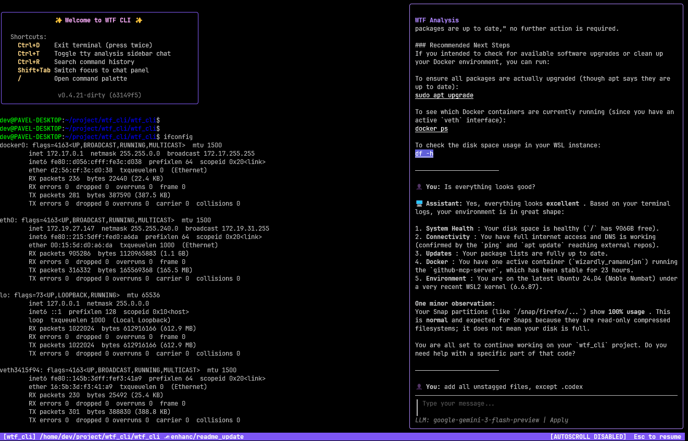

# WTF CLI - AI Assisted Terminal

A transparent PTY-based terminal wrapper with AI-powered assistance. Get instant explanations for errors, suggestions for fixes, and interactive chat with an AI that sees your terminal context.

[](https://github.com/pakru/wtf_cli/actions/workflows/go.yml)
[](https://go.dev/dl/)
[](https://github.com/pakru/wtf_cli/releases/latest)
[](LICENSE)
[](https://goreportcard.com/report/github.com/pakru/wtf_cli)
[](https://github.com/pakru/wtf_cli/releases)



## 🚀 Getting Started

### Prerequisites

- Go 1.25+
- Linux or macOS
- OpenRouter API key (for AI features)

### Installation

#### Quick Install (Recommended)

```bash
curl -fsSL https://raw.githubusercontent.com/pakru/wtf_cli/main/install.sh | bash
```

This will automatically detect your platform, download the latest release, verify checksums, and install to `~/.local/bin`.

#### Option 1: Download Pre-built Binary

Download the latest release for your platform from the [Releases page](https://github.com/pakru/wtf_cli/releases):

```bash
# Linux/macOS example
wget https://github.com/pakru/wtf_cli/releases/latest/download/wtf_cli_<version>_<os>_<arch>.tar.gz
tar -xzf wtf_cli_<version>_<os>_<arch>.tar.gz
chmod +x wtf_cli
./wtf_cli --version

# Optionally install to PATH
mkdir -p ~/.local/bin
mv wtf_cli ~/.local/bin/
```

#### Option 2: Build from Source

```bash
# Clone the repository
git clone https://github.com/pakru/wtf_cli.git
cd wtf_cli

# Build
make build

# Run
./wtf_cli
```

### Usage

```bash
# Check version
./wtf_cli --version

# Start the wrapper
./wtf_cli

# Use your terminal normally
ls -la
cd ~/projects

# Press / at an empty prompt to open command palette
# Select a command with arrow keys and Enter

# Press Ctrl+R to search command history
# Type to filter, use Up/Down/Tab to select

# Press Ctrl+T to toggle the AI chat sidebar
# Type questions and get context-aware responses
```

## ✨ Features

### Commands (Available)

| Command | Description |
|---------|-------------|
| `/chat` | Toggle AI chat sidebar |
| `/explain` | Analyze last output and suggest fixes |
| `/history` | Show command history |
| `/settings` | Open settings panel |
| `/help` | Show help |

### Keyboard Shortcuts

| Shortcut | Action |
|----------|--------|
| `Ctrl+D` | Exit terminal (press twice) |
| `Ctrl+C` | Cancel current command |
| `Ctrl+Z` | Suspend process |
| `Ctrl+R` | Search command history |
| `Ctrl+T` | Toggle AI chat sidebar |
| `Shift+Tab` | Switch focus between terminal and chat sidebar |
| `/` | Open command palette (at empty prompt) |
| `Esc` | Close palette/panel/sidebar |
| `←`/`→` | Move cursor in command line |
| `Home`/`End` | Jump to start/end of command line |

### Tech Stack

- **Go** - Core language
- **[creack/pty](https://github.com/creack/pty)** - Pseudo-terminal management
- **[Bubble Tea v2](https://github.com/charmbracelet/bubbletea)** - TUI framework
- **[Lipgloss v2](https://github.com/charmbracelet/lipgloss)** - Styling
- **[vito/midterm](https://github.com/vito/midterm)** - Full-screen app terminal emulation (vim, htop, etc.)
- **[go-git](https://github.com/go-git/go-git)** - Git integration (branch display in status bar)
- **AI Providers** - OpenRouter, OpenAI, Anthropic, Google Gemini, GitHub Copilot


## 🧪 Development

### Available Make Targets

```bash
# Run all checks, build, and test (default)
make all

# Build the binary
make build

# Run all tests
make test

# Format all Go code
make fmt

# Run static analysis
make vet

# Run formatting and vetting
make lint

# Full pre-commit validation (fmt, vet, build, test)
make check

# Clean build artifacts
make clean

# Build and run the application
make run

# Show help with all available targets
make help

# Run directly without make
go run cmd/wtf_cli/main.go
```

### Code Quality

Before committing, run:
```bash
make check
```

This will automatically:
1. Format your code with `go fmt`
2. Run `go vet` for static analysis
3. Build the project
4. Run all tests

## 🔧 Troubleshooting

### Go Version Mismatch Error

If you see an error like:
```
compile: version "go1.25.0" does not match go tool version "go1.25.5"
```

This happens when Go is updated but cached packages are from an older version. Fix it with:

```bash
# Clear all caches and reinstall standard library
rm -rf ~/.cache/go-build
go clean -cache -modcache -i -r
go install std

# Rebuild the project
make clean
make build
```

## 🚀 Release Process

For maintainers: See [docs/RELEASE.md](docs/RELEASE.md) for detailed release instructions.

**Quick Release:**
```bash
# Commit your changes
git add .
git commit -m "Your changes"

# Create and push tag (version comes from the tag)
git tag vX.Y.Z
git push origin main --tags

# GitHub Actions will automatically build and create the release
```

## 📝 Configuration

Configuration file: `~/.wtf_cli/config.json`

Supported providers: `openrouter`, `openai`, `copilot`, `anthropic`, `google`

```json
{
  "llm_provider": "openrouter",
  "openrouter": {
    "api_key": "<your_openrouter_api_key>",
    "model": "google/gemini-3.0-flash",
    "temperature": 0.7,
    "max_tokens": 2000,
    "api_timeout_seconds": 30
  },
  "providers": {
    "openai": {
      "api_key": "<your_openai_api_key>",
      "model": "gpt-4o",
      "temperature": 0.7,
      "max_tokens": 2000,
      "api_timeout_seconds": 30
    },
    "anthropic": {
      "api_key": "<your_anthropic_api_key>",
      "model": "claude-3-5-sonnet-20241022",
      "temperature": 0.7,
      "max_tokens": 2000,
      "api_timeout_seconds": 30
    },
    "google": {
      "api_key": "<your_google_api_key>",
      "model": "gemini-3-flash-preview",
      "temperature": 0.7,
      "max_tokens": 8192,
      "api_timeout_seconds": 60
    },
    "copilot": {
      "model": "gpt-4o",
      "temperature": 0.7,
      "max_tokens": 2000,
      "api_timeout_seconds": 30
    }
  },
  "buffer_size": 2000,
  "context_window": 1000,
  "status_bar": {
    "position": "bottom"
  },
  "update_check": {
    "enabled": true,
    "interval_hours": 1
  },
  "log_file": "~/.wtf_cli/logs/wtf_cli.log",
  "log_format": "json",
  "log_level": "info"
}
```

> **Note:** Only the fields for your active `llm_provider` need to be set. `copilot` uses GitHub Copilot CLI authentication — no API key required.

## 🤝 Contributing

Contributions are welcome! Please read the contribution guidelines first.

## 📄 License

MIT License - see [LICENSE](LICENSE) for details.
