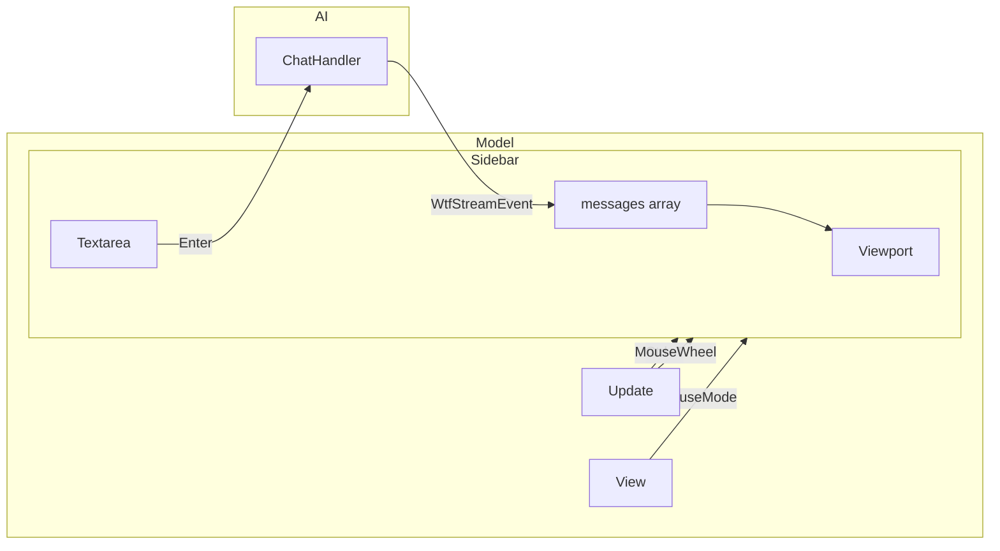

# Chat-Enhanced WTF Analysis Dialog Design

Enhance the WTF Analysis dialog with interactive chat capabilities, mouse wheel scrolling, and improved markdown styling.

## Confirmed Decisions

| Decision | Choice |
|----------|--------|
| Focus shortcut | `Ctrl+T` to switch between TTY and chat input |
| Chat history | Persist for entire session (even when panel is closed) |
| Response display | Append to viewport (conversational format) |
| Mouse selection | Shift+click preserves native terminal selection |

---

## Architecture Alignment

> [!IMPORTANT]
> **Bubble Tea v2**: Mouse mode is set via `tea.View.MouseMode` in `View()`, NOT via program options. No global capture; enable only when chat panel is visible and not in full-screen mode.

**Key principles**:
- **Evolve `sidebar.go`** into chat-capable panel (not a parallel system)
- **Route `Ctrl+T` in `model.go`** when sidebar is visible (not in `input.go`)
- **Conditional mouse mode** via `tea.View` in `View()` method
- **Reuse existing stream throttle pattern** from `/explain` flow
- **Cap message history** sent to AI (last N messages + fresh TTY context)

---

## Proposed Changes

### Component 1: Shared Types

---

#### [NEW] [chat_types.go](file:///home/dev/project/wtf_cli/wtf_cli/pkg/ai/chat_types.go)

Shared types (no imports to avoid cycles):

```go
package ai

type ChatMessage struct {
    Role    string // "user" | "assistant" | "system"
    Content string
}
```

---

### Component 2: Evolve Sidebar to Chat Panel

---

#### [MODIFY] [sidebar.go](file:///home/dev/project/wtf_cli/wtf_cli/pkg/ui/components/sidebar/sidebar.go)

Add chat input capability:

```go
import "wtf_cli/pkg/ai"

type Sidebar struct {
    // Existing fields
    title, content string
    visible        bool
    width, height  int
    scrollY        int
    lines          []string
    follow         bool
    
    // NEW: Chat mode
    chatMode       bool              // When true, show input area
    textarea       textarea.Model    // Chat input (bubbles/textarea)
    focused        FocusTarget       // Input | Viewport
    messages       []ai.ChatMessage  // Persistent conversation history
    streaming      bool              // True while assistant response streaming
}

type FocusTarget int
const (
    FocusViewport FocusTarget = iota
    FocusInput
)
```

**New methods**:
- `EnableChatMode()` - Switch to interactive mode
- `ToggleFocus()` - Switch between input and viewport
- `FocusInput()` - Focus the input textarea
- `IsFocusedOnInput() bool` - Check if input is focused
- `HandleMouse(msg tea.MouseMsg) tea.Cmd` - Wheel scroll
- `SubmitMessage() (string, bool)` - Get input text, clear textarea
- `AppendUserMessage(content string)` - Add user message to history
- `StartAssistantMessage()` - Create empty assistant message
- `AppendErrorMessage(errMsg string)` - Add error message to chat
- `UpdateLastMessage(delta string)` - Append to last assistant message
- `RenderMessages() string` - Render all messages as markdown
- `GetMessages() []ai.ChatMessage` - For AI context
- `HandlePaste(content string)` - Route paste to textarea
- `ShouldHandleKey(msg tea.KeyPressMsg) bool` - Returns true for Esc, Enter, nav keys, and **all printable keys when focused on input**

**Layout** (when `chatMode=true`):
```
┌─────────────────────┐
│ WTF Analysis        │  <- title
├─────────────────────┤
│                     │
│  Viewport           │  <- scrollable markdown
│  (messages)         │     rendered from messages[]
│                     │
├─────────────────────┤
│ > Type here...      │  <- textarea (3 lines)
└─────────────────────┘
```

---

### Component 3: Key Routing in Model

---

#### [MODIFY] [model.go](file:///home/dev/project/wtf_cli/wtf_cli/pkg/ui/model.go)

Route `Ctrl+T` and Tab in `Update()` when sidebar is visible:

```go
case tea.KeyPressMsg:
    // Full-screen mode: bypass all shortcuts, route to PTY
    if m.fullScreenMode {
        handled, cmd := m.inputHandler.HandleKey(msg)
        if handled {
            return m, cmd
        }
        return m, nil  // Always return here to avoid fallthrough
    }
    
    // Sidebar chat mode: intercept focus keys
    if m.sidebar != nil && m.sidebar.IsVisible() && m.sidebar.IsChatMode() {
        switch msg.String() {
        case "ctrl+t":
            m.sidebar.ToggleFocus()
            return m, nil
        case "tab":
            m.sidebar.ToggleFocus()
            return m, nil
        }
        
        // Route to sidebar if it should handle the key
        // ShouldHandleKey returns true for printable keys when input focused
        if m.sidebar.ShouldHandleKey(msg) {
            return m, m.sidebar.Update(msg)
        }
    }
    // ... existing key handling

case tea.PasteMsg:
    // Route paste to chat input when focused
    if m.sidebar != nil && m.sidebar.IsVisible() && m.sidebar.IsChatMode() {
        if m.sidebar.IsFocusedOnInput() {
            m.sidebar.HandlePaste(msg.Content)
            return m, nil
        }
    }
    // ... existing paste handling
```

**ShouldHandleKey implementation**:
```go
func (s *Sidebar) ShouldHandleKey(msg tea.KeyPressMsg) bool {
    // Always handle navigation and action keys
    switch msg.String() {
    case "esc", "enter", "up", "down", "pgup", "pgdown", "home", "end":
        return true
    }
    
    // Handle printable keys when input is focused
    if s.focused == FocusInput && msg.Key().Text != "" {
        return true
    }
    
    // Handle backspace, delete when input focused
    if s.focused == FocusInput {
        switch msg.String() {
        case "backspace", "delete", "ctrl+a", "ctrl+e", "ctrl+k", "ctrl+u":
            return true
        }
    }
    
    return false
}
```

---

### Component 4: Conditional Mouse Mode

---

#### [MODIFY] [model.go](file:///home/dev/project/wtf_cli/wtf_cli/pkg/ui/model.go) - View()

Enable mouse only when chat sidebar is visible:

```go
func (m Model) View() tea.View {
    var v tea.View
    
    // Full-screen mode: no mouse
    if m.fullScreenMode && m.fullScreenPanel != nil && m.fullScreenPanel.IsVisible() {
        v.AltScreen = true
        v.SetContent(m.fullScreenPanel.View())
        return v
    }

    // Enable mouse wheel when chat sidebar is visible
    if m.sidebar != nil && m.sidebar.IsVisible() && m.sidebar.IsChatMode() {
        v.MouseMode = tea.MouseModeCellMotion
    }
    
    v.SetContent(m.renderCanvas())
    return v
}
```

---

#### [MODIFY] [model.go](file:///home/dev/project/wtf_cli/wtf_cli/pkg/ui/model.go) - Update()

Handle mouse events:

```go
case tea.MouseMsg:
    if m.sidebar != nil && m.sidebar.IsVisible() && m.sidebar.IsChatMode() {
        return m, m.sidebar.HandleMouse(msg)
    }
```

---

### Component 5: Chat Streaming (Append Pattern)

---

#### [NEW] [chat_handler.go](file:///home/dev/project/wtf_cli/wtf_cli/pkg/commands/chat_handler.go)

```go
import "wtf_cli/pkg/ai"

const MaxChatHistoryMessages = 10

type ChatHandler struct{}

// StartChatStream builds context from messages + buffer and streams response
func (h *ChatHandler) StartChatStream(
    ctx *Context,
    messages []ai.ChatMessage,
) (<-chan WtfStreamEvent, error) {
    // Cap history to last N messages
    capped := messages
    if len(messages) > MaxChatHistoryMessages {
        capped = messages[len(messages)-MaxChatHistoryMessages:]
    }
    
    // Build AI messages from history + fresh TTY context
    aiMessages := buildChatMessages(capped, ctx)
    
    // Stream using existing OpenRouter pattern (same as ExplainHandler)
}

// buildChatMessages constructs AI messages from chat history + terminal context
func buildChatMessages(
    history []ai.ChatMessage,
    ctx *Context,
) []ai.Message {
    lines := ctx.GetLastNLines(ai.DefaultContextLines)
    
    // Use existing helper (pulls last command/exit code from session)
    meta := buildTerminalMetadata(ctx)
    
    // Use existing BuildTerminalContext which returns SystemPrompt + UserPrompt
    termCtx := ai.BuildTerminalContext(lines, meta)
    
    // Build messages: system + TTY context as developer message + history
    msgs := []ai.Message{
        {Role: "system", Content: termCtx.SystemPrompt},
        {Role: "developer", Content: termCtx.UserPrompt},  // TTY context
    }
    
    // Append conversation history
    for _, msg := range history {
        msgs = append(msgs, ai.Message{
            Role:    msg.Role,
            Content: msg.Content,
        })
    }
    
    return msgs
}
```

> [!NOTE]
> Uses existing `buildTerminalMetadata(ctx)` from handlers.go (pulls LastCommand/ExitCode from session) and `ai.BuildTerminalContext()`. No new exports needed.

---

#### [MODIFY] [model.go](file:///home/dev/project/wtf_cli/wtf_cli/pkg/ui/model.go) - Submit Input Wiring

Handle user message submission and start chat stream:

```go
// ChatSubmitMsg indicates user submitted a chat message
type ChatSubmitMsg struct {
    Content string
}

case ChatSubmitMsg:
    if m.sidebar == nil || !m.sidebar.IsChatMode() || msg.Content == "" {
        return m, nil
    }
    
    // Guard: refuse new stream while one is active (prevents deadlock)
    if m.wtfStream != nil {
        // Stream in progress, ignore or queue
        return m, nil
    }
    
    // Add user message to sidebar history
    m.sidebar.AppendUserMessage(msg.Content)
    m.sidebar.RefreshView()
    
    // Build context using existing NewContext (m.buffer, m.session, m.currentDir are Model fields)
    cmdCtx := commands.NewContext(m.buffer, m.session, m.currentDir)
    chatHandler := &commands.ChatHandler{}
    
    stream, err := chatHandler.StartChatStream(cmdCtx, m.sidebar.GetMessages())
    if err != nil {
        m.sidebar.AppendErrorMessage(err.Error())
        return m, nil
    }
    
    // Guard nil stream to prevent listenToWtfStream from blocking
    if stream == nil {
        m.sidebar.AppendErrorMessage("Failed to start chat stream")
        return m, nil
    }
    
    m.wtfStream = stream
    return m, listenToWtfStream(m.wtfStream)
```

**Sidebar Enter key handling** (in sidebar.Update):
```go
case "enter":
    if s.focused == FocusInput && !s.streaming {
        content, ok := s.SubmitMessage()
        if ok && content != "" {
            return func() tea.Msg { return ChatSubmitMsg{Content: content} }
        }
    }
    return nil
```

---

#### [MODIFY] [model.go](file:///home/dev/project/wtf_cli/wtf_cli/pkg/ui/model.go)

Change stream handling to append, not overwrite.

**Use `sidebar.streaming` flag** (not `streamThrottlePending`) to detect first chunk:

```go
case commands.WtfStreamEvent:
    if msg.Err != nil {
        // Clear all stream state (guard nil)
        if m.sidebar != nil {
            m.sidebar.SetStreaming(false)
            // Only append error in chat mode
            if m.sidebar.IsChatMode() {
                m.sidebar.AppendErrorMessage(msg.Err.Error())
            }
        }
        m.wtfStream = nil
        m.streamThrottlePending = false
        return m, nil
    }
    
    // Chat mode: append to messages, don't overwrite content
    if m.sidebar != nil && m.sidebar.IsChatMode() {
        if msg.Delta != "" {
            // First chunk: create new assistant message + immediate refresh
            if !m.sidebar.IsStreaming() {
                m.sidebar.SetStreaming(true)
                m.sidebar.StartAssistantMessage()
            }
            
            // Update last message with delta
            m.sidebar.UpdateLastMessage(msg.Delta)
            
            // Throttle rendering (streamThrottlePending is for render, not message start)
            if !m.streamThrottlePending {
                m.streamThrottlePending = true
                // Immediate refresh on first chunk for responsiveness
                m.sidebar.RefreshView()
                return m, tea.Batch(
                    tea.Tick(m.streamThrottleDelay, func(time.Time) tea.Msg {
                        return streamThrottleFlushMsg{}
                    }),
                    listenToWtfStream(m.wtfStream),
                )
            }
            // Subsequent chunks: just listen, don't schedule another tick
            return m, listenToWtfStream(m.wtfStream)
        }
        if msg.Done {
            m.sidebar.SetStreaming(false)
            m.sidebar.RefreshView()  // Final refresh
            m.wtfStream = nil
            m.streamThrottlePending = false
            return m, nil
        }
    } else {
        // Non-chat mode: existing behavior (SetContent)
        // ... existing code ...
    }
```

**Throttle flush (chat-aware)**:
```go
case streamThrottleFlushMsg:
    m.streamThrottlePending = false
    
    // Chat mode: re-render from messages (not SetContent)
    if m.sidebar != nil && m.sidebar.IsChatMode() {
        m.sidebar.RefreshView()  // Re-renders viewport from messages[]
    } else if m.sidebar != nil && m.sidebar.IsVisible() {
        // Non-chat mode: existing SetContent behavior
        m.sidebar.SetContent(m.wtfContent)
    }
    return m, nil
```

---

### Component 6: Enhanced Markdown

---

#### [NEW] [markdown.go](file:///home/dev/project/wtf_cli/wtf_cli/pkg/ui/components/shared/markdown.go)

Extract and enhance from sidebar's `renderMarkdown()`:
- Headings (H1, H2, H3)
- Inline code with background
- User vs assistant message styling

---

## Architecture Diagram



---

## Implementation Checklist

1. Add `textarea.Model` field to Sidebar
2. Implement `EnableChatMode()` with layout split
3. Route `Ctrl+T`/`Tab` in `model.go` Update()
4. Set `v.MouseMode` conditionally in View()
5. Handle `tea.MouseMsg` for wheel scroll
6. Add `ChatHandler` using existing stream pattern
7. Cap message history in AI context builder
8. Extract markdown renderer to shared package

---

## Verification Plan

```bash
# Run existing tests (ensure no regressions)
make test

# Manual testing
# 1. Run wtf_cli, execute a command
# 2. Press / then select /explain
# 3. Press Ctrl+T to focus chat input
# 4. Type question, press Enter
# 5. Verify response appends
# 6. Close panel (Esc), reopen - verify history preserved
# 7. Mouse wheel scrolls in chat viewport
# 8. Shift+click selects text normally
```
