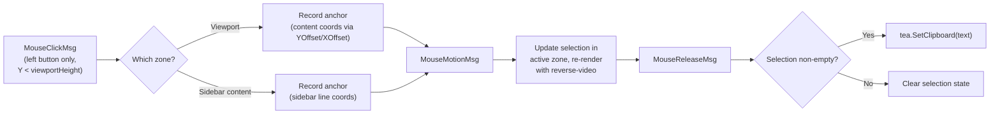

# In-App Text Selection for Terminal Viewport (Crush-Style)

## Problem

Enabling `tea.MouseModeCellMotion` in `View()` (line 1187 of [model.go](file:///home/dev/project/wtf_cli/wtf_cli/pkg/ui/model.go#L1187)) broke native terminal text selection because mouse events are now captured by Bubble Tea instead of the terminal emulator. However, removing it would lose mouse wheel scrolling.

## Goal

Implement **Crush-style in-app text selection** so mouse tracking can stay enabled while users can still select and copy text from the terminal viewport. This gives us both mouse wheel scrolling *and* text selection, the same way Crush IDE handles it.

## Design Overview



---

## Design Decisions

| Decision | Choice | Rationale |
|----------|--------|-----------|
| Selection highlight style | **Reverse-video** (`\x1b[7m`) | Matches standard terminal selection behavior; works on any color scheme |
| Copy trigger | **Auto-copy on mouse-up** | Matches Crush behavior; friction-free UX |
| Scope | **Viewport + Sidebar** | Both panels should be selectable |
| Copy mechanism | **`tea.SetClipboard`** | Idiomatic Bubble Tea v2 API; stays coordinated with renderer |
| Mouse mode | **Keep `MouseModeCellMotion`** | Captures button+drag events; `AllMotion` would add unneeded hover events |
| Selection package | **`pkg/ui/components/selection`** | Neutral package; avoids sidebar importing viewport |

---

## Notes on Review Findings

> [!NOTE]
> **`MouseModeCellMotion` is sufficient for drag.** Bubble Tea v2 delivers `tea.MouseMotionMsg` during a drag (button held) under `CellMotion`. `AllMotion` additionally delivers hover events (no button held) which we do not need. Crush uses `CellMotion`. No mouse mode change required.

> [!NOTE]
> **`tea.SetClipboard` is the idiomatic Bubble Tea v2 clipboard API.** It routes through the renderer so output is never interleaved with terminal rendering. No external clipboard dependency is needed.

> [!NOTE]
> **Shift+drag is often available, not universal.** Many modern terminals support `Shift+drag` to bypass mouse tracking for native selection, but tmux, SSH setups, and certain terminal configurations can change this behavior. It will be documented as "often available."

---

## Proposed Changes

### Component 1: Selection State Model

#### [NEW] [selection.go](file:///home/dev/project/wtf_cli/wtf_cli/pkg/ui/components/selection/selection.go)

A new **neutral package** `pkg/ui/components/selection` (imported by both viewport and sidebar — no circular dependency).

```go
// Selection tracks a mouse text selection range within a panel.
// Rows and columns are in panel-local content coordinates (scroll-adjusted).
type Selection struct {
    Active    bool // True while the left mouse button is held
    AnchorRow int
    AnchorCol int
    EndRow    int
    EndCol    int
}
```

Key methods:
- `Start(row, col int)` — called on left-button-down; sets anchor and end to the same position
- `Update(row, col int)` — called on drag motion; updates end position
- `Finish()` — called on mouse-up; **always clears `Active` and the range**, returns the extracted text (empty string if the range is empty/point). The caller checks for `text != ""` to decide whether to copy. This is explicit in the contract so the diagram's "Clear selection state" path is guaranteed even if the caller ignores the return value.
- `Clear()` — resets all state unconditionally
- `IsEmpty() bool` — true if anchor == end (no actual selection)
- `Normalize() (startRow, startCol, endRow, endCol int)` — returns range in top-to-bottom order (handles upward drags)
- `Contains(row, col int) bool` — returns whether a cell is within the selection range

---

### Component 2: Text Extraction + Coordinate Mapping

#### [MODIFY] [viewport.go](file:///home/dev/project/wtf_cli/wtf_cli/pkg/ui/components/viewport/viewport.go)

Add selection state and coordinate-aware rendering to `PTYViewport`.

**New field:**
```go
sel selection.Selection
```

**Coordinate mapping (critical):**

Raw mouse `(X, Y)` from the terminal refers to *screen* coordinates within the viewport widget. The viewport is a sliding window over the full content. Mapping to content coordinates:

```go
contentRow = screenRow + v.Viewport.YOffset()
contentCol = screenCol + v.Viewport.XOffset()
```

Column counting within a line must be **ANSI and wide-rune aware** using `github.com/charmbracelet/x/ansi` — specifically `ansi.StringWidth` and `ansi.Strip` for extracting plain text, and grapheme-cluster iteration for correct column mapping.

**New methods:**

```go
// StartSelection begins a selection at screen coordinates (gated: left button, in bounds).
// Converts to content coords via YOffset/XOffset.
func (v *PTYViewport) StartSelection(screenRow, screenCol int)

// UpdateSelection extends the selection during drag.
func (v *PTYViewport) UpdateSelection(screenRow, screenCol int)

// FinishSelection ends the drag, extracts plain text from the selected
// content rows/cols (ANSI-stripped, wide-rune aware), and returns it.
func (v *PTYViewport) FinishSelection() string

// ClearSelection resets selection state and re-renders.
func (v *PTYViewport) ClearSelection()

// HasActiveSelection returns true if a drag is currently in progress.
func (v *PTYViewport) HasActiveSelection() bool

// HasSelection returns true if a non-empty completed selection exists.
func (v *PTYViewport) HasSelection() bool
```

**Modified rendering:**

`renderContent()` is extended to call `ApplySelectionHighlight` when `sel` is non-empty before passing the string to `v.Viewport.SetContent(...)`. The highlight is applied to the *content* buffer lines (pre-scroll-window), not just visible lines — the viewport component handles windowing.

**Selection cleared in `AppendOutput`:**

```go
func (v *PTYViewport) AppendOutput(data []byte) {
    v.ClearSelection() // stale selection on new PTY output
    // ... existing logic
}
```

This handles **both** the `ptyBatchFlushMsg` path and the forced flush path in `flushPTYBatch()` (model.go line 1115), since both ultimately call `AppendOutput`.

---

### Component 3: Mouse Event Routing in Model

#### [MODIFY] [model.go](file:///home/dev/project/wtf_cli/wtf_cli/pkg/ui/model.go)

**A) Mouse mode stays `CellMotion`** — no change to line 1187. Comment updated:

```diff
- // Enable mouse wheel reporting so the application receives wheel events
- // instead of the terminal emulator consuming them for its own scrollback.
- // MouseModeCellMotion enables click, release, and wheel events.
+ // MouseModeCellMotion captures click, release, drag (button+motion), and
+ // wheel events. AllMotion is intentionally avoided — we do not need hover.
+ // Native text selection is available via Shift+drag in most terminals.
```

**B) New mouse handlers:**

`tea.MouseMsg` (the old catch-all at line 298) is **replaced** by three typed handlers. The `tea.MouseWheelMsg` handler (line 271) is **updated** to call `sidebar.HandleWheel` (renamed from `HandleMouse`) instead of the removed stub.

```go
// Replaces existing tea.MouseWheelMsg case (line 279-282):
case tea.MouseWheelMsg:
    if m.fullScreenMode {
        return m, nil
    }
    if !m.terminalFocused && m.sidebar != nil && m.sidebar.IsVisible() {
        cmd := m.sidebar.HandleWheel(msg)  // renamed from HandleMouse
        return m, cmd
    }
    // ... rest unchanged

// New: replaces tea.MouseMsg catch-all (lines 298-304):
case tea.MouseClickMsg:
    if m.fullScreenMode || msg.Button != tea.MouseLeft {
        return m, nil
    }
    viewportHeight := m.height - 1  // reserve status bar row
    if msg.Y >= viewportHeight {
        return m, nil  // click on status bar row — ignore
    }
    if m.sidebar != nil && m.sidebar.IsVisible() {
        viewportWidth, _ := splitSidebarWidths(m.width)
        if msg.X >= viewportWidth {
            // Delegate hit-testing to sidebar — encapsulates all chrome bounds
            if row, col, ok := m.sidebar.SelectionPoint(msg.X, msg.Y, viewportWidth); ok {
                m.sidebar.StartSelection(row, col)
            }
            return m, nil
        }
    }
    // Viewport zone
    m.viewport.StartSelection(msg.Y, msg.X)
    return m, nil

case tea.MouseMotionMsg:
    if m.fullScreenMode {
        return m, nil
    }
    if m.sidebar != nil && m.sidebar.HasActiveSelection() {
        viewportWidth, _ := splitSidebarWidths(m.width)
        if row, col, ok := m.sidebar.SelectionPoint(msg.X, msg.Y, viewportWidth); ok {
            m.sidebar.UpdateSelection(row, col)
        }
    } else if m.viewport.HasActiveSelection() {
        m.viewport.UpdateSelection(msg.Y, msg.X)
    }
    return m, nil

case tea.MouseReleaseMsg:
    if m.fullScreenMode {
        return m, nil
    }
    if m.sidebar != nil && m.sidebar.HasActiveSelection() {
        // Capture final position from release coords before finishing
        viewportWidth, _ := splitSidebarWidths(m.width)
        if row, col, ok := m.sidebar.SelectionPoint(msg.X, msg.Y, viewportWidth); ok {
            m.sidebar.UpdateSelection(row, col)
        }
        text := m.sidebar.FinishSelection()
        if text != "" {
            m.statusBar.SetMessage("Selected text copied to clipboard")
            return m, tea.Batch(
                tea.SetClipboard(text),
                tea.Tick(2*time.Second, func(time.Time) tea.Msg {
                    return clearStatusMsgMsg{}
                }),
            )
        }
        return m, nil
    }
    if m.viewport.HasActiveSelection() {
        // Capture final position from release coords before finishing
        m.viewport.UpdateSelection(msg.Y, msg.X)
        text := m.viewport.FinishSelection()
        if text != "" {
            m.statusBar.SetMessage("Selected text copied to clipboard")
            return m, tea.Batch(
                tea.SetClipboard(text),
                tea.Tick(2*time.Second, func(time.Time) tea.Msg {
                    return clearStatusMsgMsg{}
                }),
            )
        }
    }
    return m, nil
```

**E) New message type for status clear:**

```go
type clearStatusMsgMsg struct{}
```

On `clearStatusMsgMsg`: only clear the status bar if the message is still the copy confirmation — prevents a stale timer from erasing a newer message set by another action:

```go
case clearStatusMsgMsg:
    if m.statusBar.GetMessage() == "Selected text copied to clipboard" {
        m.statusBar.SetMessage("")
    }
    return m, nil
```

This mirrors the intent of the `exitConfirmID` guard used by the Ctrl+D timeout.

**C) Selection clearing on keypress:**

In the `tea.KeyPressMsg` path, after `inputHandler.HandleKey` returns `handled=true` (key went to PTY): `m.viewport.ClearSelection()` and `m.sidebar.ClearSelection()`. Selection clearing on PTY output is handled inside `AppendOutput` (see Component 2).

---

### Component 4: Mouse Event Throttle Filter

#### [NEW] [mouse_filter.go](file:///home/dev/project/wtf_cli/wtf_cli/pkg/ui/mouse_filter.go)

Rate-limits high-frequency mouse events from trackpad scroll bursts (borrowed from Crush):

```go
var lastMouseEvent time.Time

func MouseEventFilter(_ tea.Model, msg tea.Msg) tea.Msg {
    switch msg.(type) {
    case tea.MouseWheelMsg, tea.MouseMotionMsg:
        now := time.Now()
        if now.Sub(lastMouseEvent) < 15*time.Millisecond {
            return nil
        }
        lastMouseEvent = now
    }
    return msg
}
```

> [!NOTE]
> **Filter throttles wheel and motion together.** A burst of wheel events immediately before a drag can cause the first drag `MouseMotionMsg` to be dropped. This is a **visual smoothness trade-off only** — correctness is protected by updating the selection endpoint from the release coordinates in `MouseReleaseMsg`. No fix is required.

#### [MODIFY] [main.go](file:///home/dev/project/wtf_cli/wtf_cli/cmd/wtf_cli/main.go)

```diff
- p := tea.NewProgram(model)
+ p := tea.NewProgram(model, tea.WithFilter(ui.MouseEventFilter))
```

---

### Component 5: Selection Highlight Rendering

#### [NEW] [selection_render.go](file:///home/dev/project/wtf_cli/wtf_cli/pkg/ui/components/viewport/selection_render.go)

```go
// ApplySelectionHighlight overlays reverse-video on the selected range
// within the content string. Uses charmbracelet/x/ansi for ANSI-aware
// column counting and wide-rune / grapheme-cluster correctness.
//
// - content: the full rendered content string (may contain ANSI codes)
// - sel: a normalized Selection (startRow ≤ endRow)
//
// Returns the content with \x1b[7m ... \x1b[27m inserted around selected cells.
func ApplySelectionHighlight(content string, sel selection.Selection) string
```

Key implementation details using `github.com/charmbracelet/x/ansi`:
1. Split content on `\n` to get lines; iterate only over `[startRow, endRow]`
2. Walk each line with **`ansi.DecodeSequence`** to consume escape sequences as zero-width tokens and printable graphemes as their visual width — never ad hoc byte/rune iteration
3. Use **`ansi.StringWidth`** to measure column widths of grapheme clusters (handles wide/CJK characters correctly)
4. Insert `\x1b[7m` when the running column count reaches `startCol`, and `\x1b[27m` when it reaches `endCol`
5. When an **ANSI SGR reset** (`\x1b[0m` or `\x1b[m`) is encountered inside the highlighted range, re-emit `\x1b[7m` immediately afterward to maintain highlight continuity

**Text extraction in `FinishSelection()`:**

Use `ansi.Cut(line, startCol, endCol)` for column-bounded slicing (handles wide runes and ANSI sequences without reimplementing the logic), then `ansi.Strip(...)` to produce plain text. Both viewport and sidebar use this two-step pattern:

```go
segment := ansi.Cut(line, startCol, endCol)
plainText := ansi.Strip(segment)
```

This avoids duplicating wide-rune/ANSI slicing in both components.

---

### Component 6: Sidebar Selection Support

#### [MODIFY] [sidebar.go](file:///home/dev/project/wtf_cli/wtf_cli/pkg/ui/components/sidebar/sidebar.go)

Import `pkg/ui/components/selection`. Add `sel selection.Selection` field.

**`SelectionPoint` — encapsulated hit-testing:**

```go
// SelectionPoint maps absolute screen coordinates to sidebar content
// row/col, returning ok=false if the point is inside chrome (border,
// title, separator, textarea, footer) or out of bounds.
// originX is the screen X where the sidebar begins (= viewportWidth).
func (s *Sidebar) SelectionPoint(screenX, screenY, originX int) (row, col int, ok bool)
```

This method owns all knowledge of `sidebarBorderSize`, `sidebarPaddingH`, `chromeLines()`, etc. `model.go` never touches those constants directly.

**`HandleWheel` — replaces `HandleMouse` for wheel scroll:**

Rename the existing `HandleMouse(msg tea.MouseMsg) tea.Cmd` stub to `HandleWheel(msg tea.MouseWheelMsg) tea.Cmd` and implement sidebar scroll:

```go
func (s *Sidebar) HandleWheel(msg tea.MouseWheelMsg) tea.Cmd {
    m := msg.Mouse()
    switch m.Button {
    case tea.MouseWheelUp:
        s.handleScroll("up")
    case tea.MouseWheelDown:
        s.handleScroll("down")
    }
    return nil
}
```

The old `HandleMouse(tea.MouseMsg)` stub is removed entirely.

**Selection methods** (same interface as viewport):
- `StartSelection(row, col int)`
- `UpdateSelection(row, col int)`
- `FinishSelection() string` — uses `ansi.Cut(line, startCol, endCol)` then `ansi.Strip(...)` for each selected line; always clears active state; returns empty string for point-clicks
- `HasActiveSelection() bool`
- `ClearSelection()`

Selection is cleared when:
- `RefreshView()` is called (new streaming content)
- `Hide()` is called

---

### Component 7: Welcome Message Update

#### [MODIFY] [welcome.go](file:///home/dev/project/wtf_cli/wtf_cli/pkg/ui/components/welcome/welcome.go) *(minor)*

```
  Mouse drag    Select & copy text
                (Shift+drag often available for native terminal selection)
```

---

## Files Changed Summary

| File | Change | Risk |
|------|--------|------|
| `pkg/ui/components/selection/selection.go` | **[NEW]** Selection state in neutral package | Low |
| `pkg/ui/components/viewport/selection_render.go` | **[NEW]** ANSI+wide-rune-aware highlight renderer | Medium |
| `pkg/ui/components/viewport/viewport.go` | **[MODIFY]** Selection field, coord mapping, ClearSelection in AppendOutput | Medium |
| `pkg/ui/components/sidebar/sidebar.go` | **[MODIFY]** Selection field and methods, remove HandleMouse stub | Low |
| `pkg/ui/model.go` | **[MODIFY]** Bounded mouse routing, `tea.SetClipboard`, comment update | Medium |
| `pkg/ui/mouse_filter.go` | **[NEW]** Event throttle filter | Low |
| `cmd/wtf_cli/main.go` | **[MODIFY]** Register `WithFilter`, update comment | Low |
| `pkg/ui/components/welcome/welcome.go` | **[MODIFY]** Add selection hint | Low |

---

## Verification Plan

### Automated Tests

```bash
make check
```

#### New unit tests

| Test file | Cases |
|-----------|-------|
| `pkg/ui/components/selection/selection_test.go` | `Start`/`Update`/`Finish` lifecycle; `Normalize` with reverse drag; `Contains`; `IsEmpty` edge cases |
| `pkg/ui/components/viewport/selection_render_test.go` | Plain text; ANSI-colored text; ANSI reset inside selection (re-inserts `\x1b[7m`); wide-rune (CJK) columns; multi-line selection; empty selection → unchanged output |
| `pkg/ui/components/viewport/viewport_test.go` | `StartSelection`/`FinishSelection` extracts correct plain text; content coords via `YOffset`; selection cleared on `AppendOutput`; `HasActiveSelection` lifecycle |
| `pkg/ui/components/sidebar/sidebar_test.go` | Selection extracts plain text from `s.lines`; column bounds respected; cleared on `RefreshView`; cleared on `Hide` |
| `pkg/ui/model_test.go` | Left-click in viewport → viewport selection starts; right/middle click → no selection; click on status bar row → no selection; click in sidebar chrome (border/footer) → no selection; click in sidebar content → sidebar selection; `MouseReleaseMsg` with non-empty selection → `tea.SetClipboard`; forced PTY flush clears selection; full-screen mode ignores mouse |
| `pkg/ui/mouse_filter_test.go` | Rapid wheel/motion events dropped; events after threshold pass; non-mouse events unaffected |

### Manual Verification

1. `make run`
2. Run `ls -la` to produce output
3. Left-click-and-drag over some text in the viewport → reverse-video highlight → release → status bar shows **"Selected text copied to clipboard"**
4. Paste in another terminal → text matches (no ANSI codes)
5. Right-click → no selection started
6. Click on status bar row → no selection started
7. Click without dragging → no selection, no copy
8. Scroll with mouse wheel → scrollback works as before
9. Open sidebar (`Ctrl+T`) → drag in viewport area → viewport selection only
10. Drag in sidebar content → sidebar selection, copy on release
11. Click on sidebar border/footer → no selection
12. Drag to select, then let new PTY output arrive → selection clears
13. Select text, type a command → selection clears
14. `Shift+drag` → note behavior varies by terminal; document accordingly
15. Enter full-screen (`vim`) → no selection behavior
16. Rapid trackpad wheel → smooth scroll, no lag
